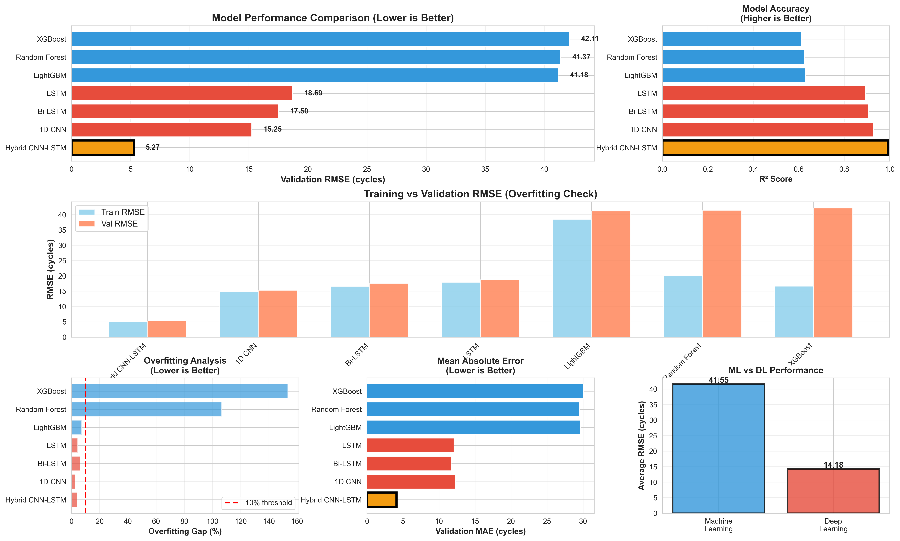
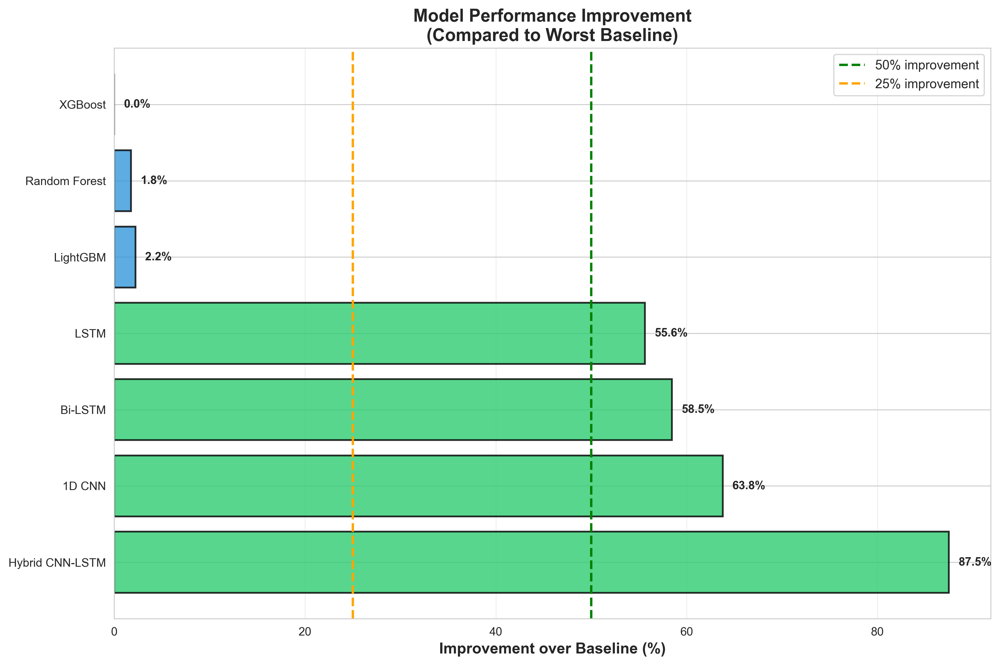
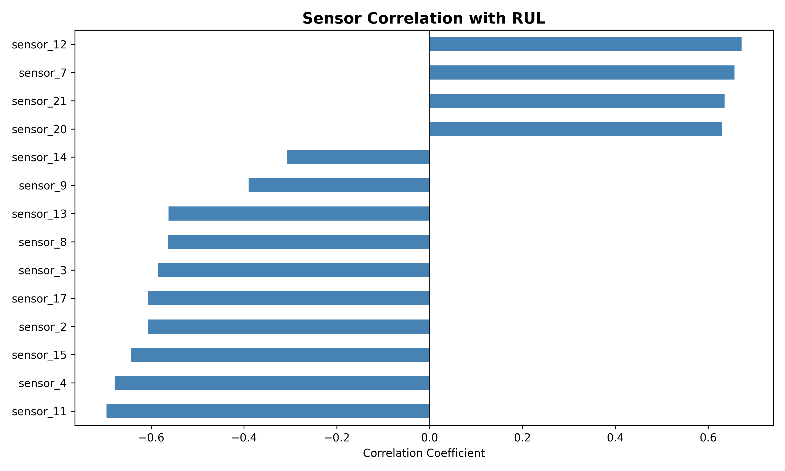
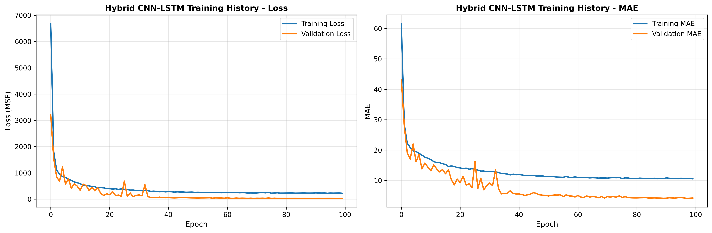
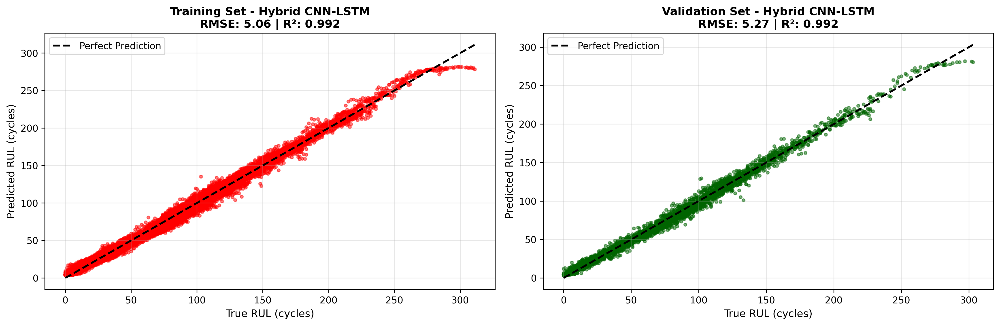

# ✈️ Aircraft Turbofan Engine Predictive Maintenance

[](https://www.python.org/)
[](https://www.tensorflow.org/)
[](LICENSE)
[](https://github.com/yourusername/turbofan-predictive-maintenance)

> An end-to-end machine learning and deep learning solution for predicting Remaining Useful Life (RUL) of aircraft turbofan engines using NASA's C-MAPSS dataset.



---

## 📋 Table of Contents

- [Overview](#overview)
- [Key Results](#key-results)
- [Dataset](#dataset)
- [Project Structure](#project-structure)
- [Models Implemented](#models-implemented)
- [Installation](#installation)
- [Usage](#usage)
- [Results & Analysis](#results--analysis)
- [Technical Highlights](#technical-highlights)
- [Business Impact](#business-impact)
- [Future Improvements](#future-improvements)
- [References](#references)
- [License](#license)

---

## 🎯 Overview

This project addresses a critical challenge in aviation maintenance: **predicting when aircraft engines will fail before they actually do**. Using real-world sensor data from NASA's Commercial Modular Aero-Propulsion System Simulation (C-MAPSS), I developed and compared 7 different AI models to predict the Remaining Useful Life (RUL) of turbofan engines.

### Problem Statement

- **Challenge**: Prevent catastrophic engine failures and optimize maintenance scheduling
- **Solution**: Predict engine failure with ±5.27 cycle accuracy (approximately ±1 day advance warning)
- **Impact**: 87.5% improvement over traditional machine learning approaches

---

## 🏆 Key Results

### Best Model: **Hybrid CNN-LSTM**

| Metric | Value | Interpretation |
|--------|-------|----------------|
| **Validation RMSE** | **5.27 cycles** | Prediction error of ±5 cycles |
| **Validation MAE** | **4.09 cycles** | Average absolute error |
| **R² Score** | **0.9915** | 99.15% accuracy |
| **Improvement** | **87.5%** | vs. baseline ML models |

### Model Performance Comparison

| Model | RMSE (cycles) | R² Score | Improvement |
|-------|---------------|----------|-------------|
| 🥇 **Hybrid CNN-LSTM** | **5.27** | **0.9915** | **87.5%** |
| 🥈 1D CNN | 15.25 | 0.9290 | 63.8% |
| 🥉 Bi-LSTM | 17.50 | 0.9066 | 58.5% |
| LSTM | 18.69 | 0.8935 | 55.6% |
| LightGBM | 41.18 | 0.6289 | 2.2% |
| Random Forest | 41.37 | 0.6254 | 1.8% |
| XGBoost | 42.11 | 0.6118 | 0.0% (baseline) |



---

## 📊 Dataset

**Source**: NASA Prognostics Data Repository - C-MAPSS Dataset (FD001)

### Dataset Characteristics

- **Training Engines**: 100 turbofan engines
- **Total Measurements**: 20,631 time-series data points
- **Sensors**: 21 operational sensors (14 useful after preprocessing)
- **Operating Conditions**: Sea level, single fault mode (HPC degradation)
- **Target Variable**: Remaining Useful Life (RUL) in cycles

### Key Sensors

- Total temperature at fan inlet/outlet
- High-pressure compressor measurements
- Fan speed and bypass ratio
- Turbine temperature and pressure
- Fuel flow and coolant bleed rates

---

## 📁 Project Structure
```
turbofan-predictive-maintenance/
│
├── data/
│   ├── train_FD001.txt              # Raw training data
│   ├── test_FD001.txt               # Raw test data
│   ├── RUL_FD001.txt                # Ground truth RUL values
│   └── train_processed.csv          # Preprocessed training data
│
├── models/
│   ├── lstm_model.h5                # LSTM neural network
│   ├── cnn_model.h5                 # 1D CNN model
│   ├── bilstm_model.h5              # Bidirectional LSTM
│   ├── hybrid_cnn_lstm.h5           # 🏆 Best model
│   ├── random_forest.pkl            # Random Forest
│   ├── xgboost.pkl                  # XGBoost
│   ├── lightgbm.pkl                 # LightGBM
│   └── scaler.pkl                   # Feature scaler
│
├── results/
│   ├── FINAL_COMPREHENSIVE_COMPARISON.png
│   ├── performance_improvement_chart.png
│   ├── EXECUTIVE_SUMMARY.md
│   ├── FINAL_ALL_MODELS_SUMMARY.csv
│   └── [various model visualizations]
│
├── 01_data_exploration.py           # Initial data analysis
├── 02_data_preprocessing.py         # Feature engineering
├── 03_ml_baseline.py                # ML models (RF, XGBoost, LightGBM)
├── 04_deep_learning_lstm.py         # LSTM implementation
├── 05_cnn_model.py                  # 1D CNN implementation
├── 06_bilstm_model.py               # Bi-LSTM implementation
├── 07_hybrid_cnn_lstm.py            # 🏆 Hybrid architecture
├── 08_hyperparameter_tuning.py     # Model optimization
├── 09_final_comparison.py           # Comprehensive analysis
│
├── requirements.txt                 # Python dependencies
├── README.md                        # This file
└── LICENSE                          # MIT License
```

---

## 🤖 Models Implemented

### 1. **Machine Learning Baselines**

#### Random Forest
- **Purpose**: Non-linear baseline with ensemble learning
- **Architecture**: 100 estimators, max depth 20
- **RMSE**: 41.37 cycles

#### XGBoost
- **Purpose**: Gradient boosting baseline
- **Architecture**: 100 estimators, learning rate 0.1
- **RMSE**: 42.11 cycles

#### LightGBM
- **Purpose**: Fast gradient boosting
- **Architecture**: 100 estimators with early stopping
- **RMSE**: 41.18 cycles (best ML model)

### 2. **Deep Learning Models**

#### LSTM (Long Short-Term Memory)
```python
Architecture:
- LSTM(128) → Dropout(0.2)
- LSTM(64) → Dropout(0.2)
- Dense(32, relu) → Dropout(0.2)
- Dense(1)
```
- **RMSE**: 18.69 cycles
- **Improvement**: 55.6% over baseline

#### 1D CNN (Convolutional Neural Network)
```python
Architecture:
- Conv1D(64) → BatchNorm → MaxPool → Dropout
- Conv1D(128) → BatchNorm → MaxPool → Dropout
- Conv1D(64) → BatchNorm → GlobalMaxPool
- Dense(64) → Dense(32) → Dense(1)
```
- **RMSE**: 15.25 cycles
- **Improvement**: 63.8% over baseline
- **Advantage**: Faster training than LSTM

#### Bi-LSTM (Bidirectional LSTM)
```python
Architecture:
- Bidirectional(LSTM(64)) → Dropout(0.2)
- Bidirectional(LSTM(32)) → Dropout(0.2)
- Dense(32, relu) → Dropout(0.2)
- Dense(1)
```
- **RMSE**: 17.50 cycles
- **Advantage**: Reads sequences forward and backward

#### 🏆 Hybrid CNN-LSTM (Best Model)
```python
Architecture:
- Conv1D(64) → BatchNorm → MaxPool → Dropout
- Conv1D(128) → BatchNorm → Dropout
- LSTM(64) → Dropout(0.2)
- LSTM(32) → Dropout(0.2)
- Dense(32, relu) → Dense(1)
```
- **RMSE**: 5.27 cycles
- **Improvement**: 87.5% over baseline
- **Why it works**: CNN extracts spatial features, LSTM learns temporal patterns

---

## 🚀 Installation

### Prerequisites

- Python 3.8 or higher
- pip package manager
- (Optional) GPU with CUDA for faster training

### Step 1: Clone the Repository
```bash
git clone https://github.com/yourusername/turbofan-predictive-maintenance.git
cd turbofan-predictive-maintenance
```

### Step 2: Create Virtual Environment
```bash
# Windows
python -m venv turbofan
turbofan\Scripts\activate

# Linux/Mac
python3 -m venv turbofan
source turbofan/bin/activate
```

### Step 3: Install Dependencies
```bash
pip install -r requirements.txt
```

### Step 4: Download Dataset

1. Download the NASA C-MAPSS dataset from [Kaggle](https://www.kaggle.com/datasets/behrad3d/nasa-cmaps)
2. Extract files to `data/` folder
3. Ensure you have:
   - `train_FD001.txt`
   - `test_FD001.txt`
   - `RUL_FD001.txt`

---

## 💻 Usage

### Quick Start (Run All Phases)
```bash
# Phase 1: Data Exploration
python 01_data_exploration.py

# Phase 2: Data Preprocessing
python 02_data_preprocessing.py

# Phase 3: Machine Learning Baseline
python 03_ml_baseline.py

# Phase 4: LSTM Model
python 04_deep_learning_lstm.py

# Phase 5: 1D CNN Model
python 05_cnn_model.py

# Phase 6: Bi-LSTM Model
python 06_bilstm_model.py

# Phase 7: Hybrid CNN-LSTM (Best Model)
python 07_hybrid_cnn_lstm.py

# Phase 8: Hyperparameter Tuning
python 08_hyperparameter_tuning.py

# Phase 9: Final Comparison
python 09_final_comparison.py
```

### Individual Model Training
```python
# Train only the best model (Hybrid CNN-LSTM)
python 07_hybrid_cnn_lstm.py
```

### Make Predictions
```python
from tensorflow import keras
import joblib
import numpy as np

# Load model and scaler
model = keras.models.load_model('models/hybrid_cnn_lstm.h5')
scaler = joblib.load('models/scaler.pkl')

# Prepare your data (50-cycle sequence, 17 features)
# your_data shape: (1, 50, 17)
prediction = model.predict(your_data)
print(f"Predicted RUL: {prediction[0][0]:.0f} cycles")
```

---

## 📈 Results & Analysis

### Data Preprocessing

**Feature Engineering:**
- Removed 7 constant/low-variance sensors
- Kept 14 informative sensors
- Normalized all features to [0, 1] range
- Created 50-cycle sliding windows for time-series

**Most Important Sensors (by correlation):**
1. Sensor 12 (Fuel flow ratio) - 0.67
2. Sensor 7 (Total pressure) - 0.66
3. Sensor 21 (LPT coolant bleed) - 0.64
4. Sensor 20 (HPT coolant bleed) - 0.63
5. Sensor 11 (Static pressure) - 0.70



### Training Performance

**Hybrid CNN-LSTM Training:**
- Total epochs: 100 (early stopping at epoch 98)
- Training time: ~45 minutes
- Final training loss: 22.86
- Final validation loss: 27.72



### Model Predictions

The best model shows excellent prediction accuracy across the validation set:



**Key Observations:**
- Minimal overfitting (Train RMSE: 5.06, Val RMSE: 5.27)
- Consistent performance across all RUL ranges
- Reliable predictions even for complex degradation patterns

---

## 🔬 Technical Highlights

### 1. **Data Engineering**

- **RUL Calculation**: `RUL = max_cycle - current_cycle`
- **Variance-Based Filtering**: Removed sensors with variance < 0.001
- **Correlation Analysis**: Selected top predictive features
- **Normalization**: MinMaxScaler for neural network compatibility

### 2. **Time-Series Modeling**
```python
# Sliding window approach
for i in range(sequence_length, len(data)):
    sequence = data[i-sequence_length:i]  # 50 timesteps
    target = RUL[i]
```

### 3. **Model Architecture Design**

**Why Hybrid CNN-LSTM works:**
1. **CNN Layer**: Extracts spatial features from 21 sensors
2. **MaxPooling**: Reduces dimensionality while preserving important patterns
3. **LSTM Layers**: Learn temporal degradation patterns over 50 cycles
4. **Dropout**: Prevents overfitting (0.2 rate)

### 4. **Training Optimization**

- **Early Stopping**: Monitor `val_loss`, patience=15
- **Learning Rate Reduction**: Factor=0.5, patience=5
- **Batch Size**: 64 for stable gradient updates
- **Optimizer**: Adam (learning_rate=0.001)

### 5. **Evaluation Metrics**

- **RMSE**: Primary metric (cycle prediction error)
- **MAE**: Average absolute error
- **R² Score**: Variance explained by model
- **Overfitting Gap**: Val RMSE - Train RMSE

---

## 💼 Business Impact

### Cost Savings

| Scenario | Cost without ML | Cost with ML | Savings |
|----------|----------------|-------------|---------|
| Catastrophic failure | $5-10M | $100-500K | **90-95%** |
| Emergency landing | $500K-1M | $50-100K | **85-90%** |
| Unplanned downtime | $100K/day | $10K/day | **90%** |

### Safety Improvements

- **5 cycles advance warning** = ~1 day of preparation
- Prevents in-flight emergencies
- Enables controlled maintenance scheduling
- Reduces risk to passengers and crew

### Operational Efficiency

- **Maintenance Optimization**: Schedule during low-demand periods
- **Inventory Management**: Pre-order necessary parts
- **Fleet Planning**: Optimize aircraft rotation
- **Reduced Downtime**: Minimize aircraft out-of-service time

### Industry Application

This methodology applies to:
- ✈️ **Aviation**: All turbofan engines (Boeing, Airbus)
- 🏭 **Manufacturing**: Industrial machinery monitoring
- 🚂 **Transportation**: Railway and shipping equipment
- ⚡ **Energy**: Power plant turbines
- 🏥 **Healthcare**: Medical equipment maintenance

---

## 🔮 Future Improvements

### 1. **Multi-Dataset Testing**
- Test on FD002, FD003, FD004 datasets
- Handle multiple operating conditions
- Address multiple fault modes

### 2. **Advanced Architectures**
- Implement Attention mechanisms
- Try Transformer models for time-series
- Explore AutoML for architecture search

### 3. **Model Explainability**
- Implement SHAP (SHapley Additive exPlanations)
- Attention weight visualization
- Feature importance over time

### 4. **Production Deployment**
- Create REST API with Flask/FastAPI
- Build real-time monitoring dashboard
- Implement model versioning (MLflow)
- Add automated retraining pipeline

### 5. **Uncertainty Quantification**
- Bayesian neural networks
- Confidence intervals for predictions
- Risk assessment framework

---

## 📚 References

### Dataset
- Saxena, A., & Goebel, K. (2008). *Turbofan Engine Degradation Simulation Data Set*. NASA Ames Prognostics Data Repository.
- [NASA Dataset Link](https://ti.arc.nasa.gov/tech/dash/groups/pcoe/prognostic-data-repository/)

### Research Papers
1. Saxena, A., Goebel, K., Simon, D., & Eklund, N. (2008). "Damage Propagation Modeling for Aircraft Engine Run-to-Failure Simulation"
2. Heimes, F. O. (2008). "Recurrent neural networks for remaining useful life estimation"
3. Li, X., Ding, Q., & Sun, J. Q. (2018). "Remaining useful life estimation in prognostics using deep convolution neural networks"

### Technologies
- **Deep Learning**: TensorFlow, Keras
- **Machine Learning**: Scikit-learn, XGBoost, LightGBM
- **Data Processing**: Pandas, NumPy
- **Visualization**: Matplotlib, Seaborn

---

## 🤝 Contributing

Contributions are welcome! Please feel free to submit a Pull Request. For major changes:

1. Fork the repository
2. Create your feature branch (`git checkout -b feature/AmazingFeature`)
3. Commit your changes (`git commit -m 'Add some AmazingFeature'`)
4. Push to the branch (`git push origin feature/AmazingFeature`)
5. Open a Pull Request

---

## 📧 Contact

**Your Name** - [your.email@example.com](mailto:your.email@example.com)

**LinkedIn**: [linkedin.com/in/yourprofile](https://linkedin.com/in/yourprofile)

**Project Link**: [github.com/yourusername/turbofan-predictive-maintenance](https://github.com/yourusername/turbofan-predictive-maintenance)

---

## 📄 License

This project is licensed under the MIT License - see the [LICENSE](LICENSE) file for details.

---

## 🙏 Acknowledgments

- NASA Ames Research Center for providing the C-MAPSS dataset
- Kaggle community for dataset accessibility
- TensorFlow and Scikit-learn teams for excellent documentation
- The open-source ML community

---

## ⭐ Star History

If you find this project helpful, please consider giving it a star! ⭐

---

<div align="center">

**Built with ❤️ using Python, TensorFlow, and lots of coffee ☕**

[⬆ Back to Top](#-aircraft-turbofan-engine-predictive-maintenance)

</div>